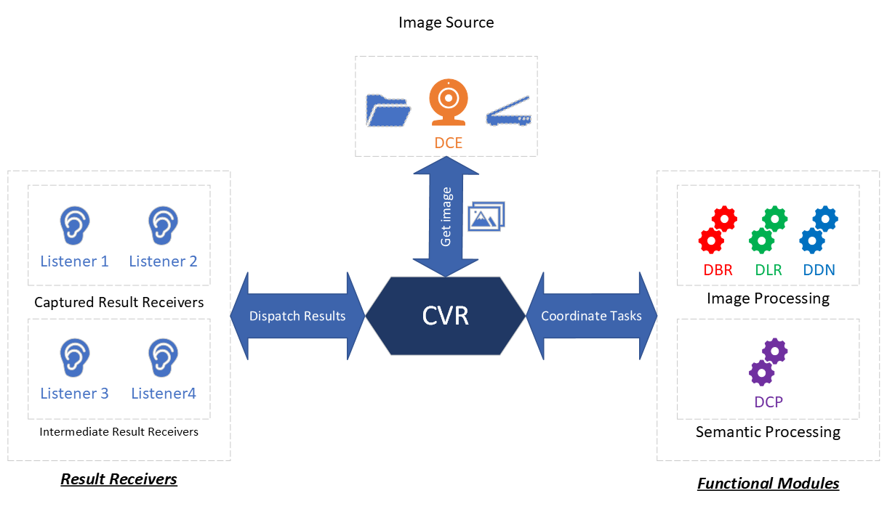

# Architecture of Dynamsoft Capture Vision

## Architecture Diagram

In the [introduction](../introduction/index.md), we have introduced the following [functional products](../introduction/index.md#functional-products):

- Dynamsoft Barcode Reader (DBR)
- Dynamsoft Label Recognizer (DLR)
- Dynamsoft Document Normalizer (DDN)
- Dynamsoft Code Parser (DCP)
- Dynamsoft Camera Enhancer (DCE)

The diagram below shows the architecture of Dynamsoft Capture Vision (DCV) and how these functional products fit into it:

> There are a few other functional products in the diagram but we can ignore them for now.

As shown in the diagram, all functional products are passive in the architecture. In other words, they are either told to perform a task or given the result of another task, both of which are done by the active part of the architecture known as Capture Vision Router (CVR).

## Capture Vision Router

Capture Vision Router (CVR) is the most important part of the DCV architecture. As its names suggests, CVR works as a router or a coordinator. Its major tasks include:

### Get Images from the Image Source  

In the DCV architecture, an image source refers to an object that has implemented the [Image Source Adapter (ISA) interface](std-input.md#image-source-adapter) such as Dynamsoft Camera Enhancer (DCE).

At runtime, CVR accepts an image source and tries to get images from it for the functional products to process. Usually, this is a continuous process which ends when the image source is exhausted.

### Coordinate Image-Processing Tasks

CVR accepts and maintains a list of image-processing settings known as ["CaptureVisionTemplates"](../parameters/file/capture-vision-template.md). Each template defines the tasks to be performed against an image. These tasks may be configured to run in parallel or one after another.

At runtime, CVR selects a CaptureVisionTemplate and analyzes it to build a task workflow, which it then runs for all images acquired from the image source.

> Read more on [CaptureVisionTemplate](../parameters/file/capture-vision-template.md).

- For tasks that can run in parallel, CVR will start to process the next image as long as it has an extra working thread to create a functional product instance.
- For tasks that must run in a sequence, CVR makes sure of the running order.

> There are two type of tasks. Read more about [Image-Processing Tasks](image-processing/index.md) and [Semantic-Processing Tasks](semantic-processing.md).

### Dispatch Results to Listening Objects

In the DCV architecture, a listening object refers to an object that has implemented either the [Captured Result Receiver (CRR) interface](std-output.md#captured-result-receiver) or [Intermediate Result Receiver (IRR) interface](std-output.md#intermediate-result-receiver).

Results are produced throughout the processing workflow of images. We categorize these results in two types:

1. Final results: also known as "Captured Results". These are the results of completed tasks.
   > There are only six types of final results. Read more on [final results](std-output.md#final-results).
2. Intermediate results: these are results produced on multiple check-points of a task.
   > These check points are called "Stages". Read more on [divisible task](../parameters/file/task-settings/index.md#divisible-task).

There is no limit to the number of listening objects.

The following diagram is a simple demostration of the process:

